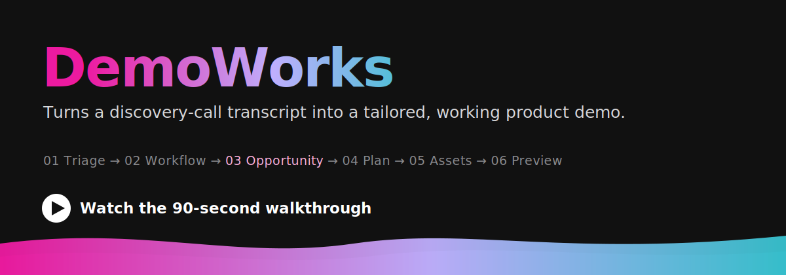

# DemoWorks

Turns a customer discovery-call transcript into a tailored, working product demo.

[](https://johninidv.github.io/demoworks/walkthrough/)

**▶ [Watch the 90-second walkthrough](https://johninidv.github.io/demoworks/walkthrough/)** (narrated) &nbsp;·&nbsp; **[See a finished demo preview](https://johninidv.github.io/demoworks/examples/summit-ridge-health-plan/06_preview/preview.html)** &nbsp;·&nbsp; read the [brief](brief.md)

> The walkthrough and preview links above are live once GitHub Pages is enabled (Settings → Pages → `main` / root). The walkthrough is also at [`walkthrough/index.html`](walkthrough/index.html) and the preview at [`examples/summit-ridge-health-plan/06_preview/preview.html`](examples/summit-ridge-health-plan/06_preview/preview.html) — open them over a local server (or Pages) so the audio plays.

## The problem

Solutions engineers build a custom demo for nearly every prospect, by hand, from the discovery-call transcript — three to five hours each of re-reading the call, picking the capabilities that fit, inventing realistic sample data, and assembling something to show. Under deadline that collapses into a generic template deck with the same fake "Acme Corp" data, and those demos land flat because the prospect sees a brochure, not their own workflow. Worse, the judgment never compounds: every transcript starts from zero. See [brief.md](brief.md).

## What this is

DemoWorks is a **folder-based specialist**. Load this folder into an AI assistant and it stops being a general assistant and becomes a demo-builder: hand it a transcript, and it reads it the way a good SE reads it, finds where the workflow hurts, maps each pain to a specific capability *with honest limits*, and produces demo materials that show the customer their own work, solved.

It is **product-agnostic**. The six-stage method never hard-codes a product — the `reference/` folder is what configures it. In this configuration, the demoed product is a fictitious claims-intelligence platform, **Veridian+ with Atlas** (building blocks: Caseboard, Atlas Skills, the Determination Library). Swap `reference/` and you re-point DemoWorks at a different product without touching the method.

## How it works

Six stages, run in order. Most transcripts stop at stage 03; only escalated opportunities go on to 04–06.

1. **Triage** — fast routing: deep build, log & stop, or no action.
2. **Workflow extraction** — a structured profile of who does what, on which documents, where it hurts.
3. **Opportunity mapping** — pain mapped to capability, with reasoning and an honest gate. *The highest-value review gate.*
4. **Demo planning** — a concrete storyline that recreates the pain and resolves it on the customer's own kind of case.
5. **Asset generation** — realistic sample documents, a configured workflow definition, saved prompts.
6. **Delivery package** — a sharable one-page HTML preview to send before the meeting.

The full method, review gates, and honesty rules are in [rules.md](rules.md).

## How to use it (quickstart for a stranger)

1. **Load the folder into an AI assistant.** Point it at [identity.md](identity.md) (who it becomes) and [rules.md](rules.md) (how it runs). It now behaves as DemoWorks.
2. **Add your input.** Create a new example folder and drop a raw transcript (or email thread) into its `00_input/` — mirror the layout of `examples/summit-ridge-health-plan/`.
3. **Run the stages in order.** Each stage fills the matching skeleton in `reference/output-templates/`, using the product knowledge in `reference/` (`solution-patterns.md`, `product-capabilities.md`, `triage-criteria.md`). Triage first; continue only if it routes to deep analysis.
4. **Review each output — they're gates, not final answers.** Read and edit each stage's file before running the next one. Stage 03 (opportunity mapping) is the one to review hardest; most transcripts stop there with a written recommendation.
5. **Escalate when it's worth a full build.** For an opportunity you choose to demo, run stages 04–06 to plan the demo, generate its assets, and produce the preview.
6. **Send the preview.** Stage 06 yields a self-contained HTML page you can open in any browser and share with the customer before the meeting.

To re-point DemoWorks at your own product, edit `reference/` — the patterns, capabilities, triage criteria, and templates — and leave `rules.md` alone.

## See it in action

A full worked run — discovery call to sharable preview — is in [examples.md](examples.md), with the rendered [Summit Ridge preview](examples/summit-ridge-health-plan/06_preview/preview.html) at the end.

## Repo map

```
brief.md       The real problem this solves.
README.md      This file.
identity.md    Who DemoWorks is when the folder is loaded.
rules.md       The method: the six-stage pipeline and the honesty rules.
examples.md    The worked Summit Ridge run, stage by stage.
reference/     The product-specific knowledge (patterns, capabilities, triage, templates).
examples/      Worked examples, including summit-ridge-health-plan/.
```

## A note on the example

Everything in the worked example is **fictitious and synthetic** — the product, the company, the people, and the records. No real product or customer data appears anywhere. The example exists only to demonstrate the method.
